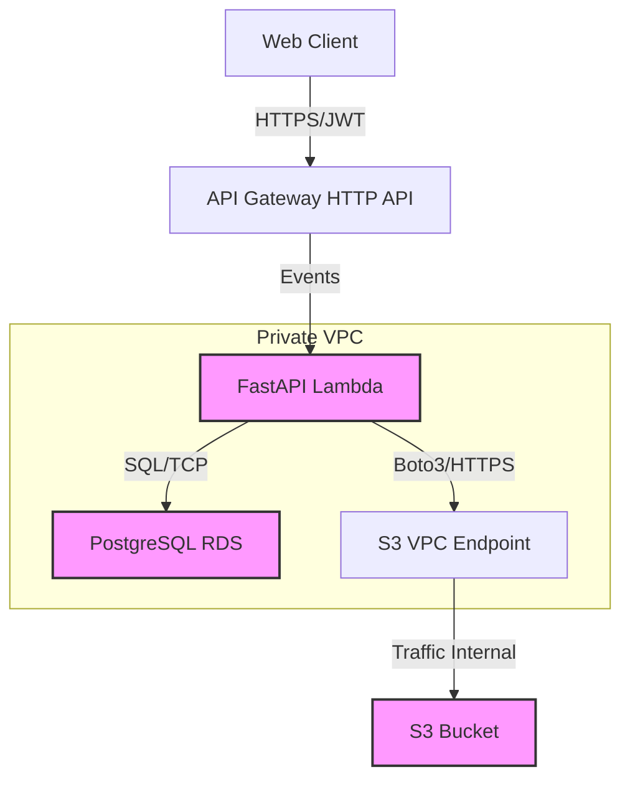

# 🏗️ Backend Architecture Design

This architecture design document outlines the system structure, service boundaries, and design patterns for the **Secure Serverless File Portal**.

## 1. System Overview

The system is a **Serverless Monolith** designed for high security, scalability, and low operational overhead.

- **Primary Compute**: AWS Lambda (Python 3.10 / FastAPI)
- **API Gateway**: HTTP API (V2) for routing and load balancing
- **Database**: PostgreSQL (RDS) for relational data (users, folder hierarchy)
- **Object Storage**: AWS S3 for binary file storage
- **Authentication**: JWT (Stateless)

### 📊 Architecture Diagram

---

## 2. Service Boundaries & Modules

Although running as a single Lambda function (`SecureFilePortal`), the codebase is modularized to support future decomposition into microservices if needed.

| Module | Responsibility | Dependencies |
|--------|---------------|--------------|
| **Auth** | User registration, Login, JWT issuance, Password hashing | `users` table |
| **Folders** | Folder creation, hierarchy management, sharing logic, access control | `folders`, `folder_access`, `users` tables |
| **Files** | File metadata, Pre-signed URL generation, S3 lifecycle hooks | `files` table, S3 Service |

### 🔍 Separation of Concerns
- **Routers (`app/routers`)**: Handle HTTP request/response, validation (Pydantic), and call services.
- **Services (`app/services`)**: *Recommended* for complex business logic (currently logic is often in routers - **Refactor Opportunity**).
- **Data Access (`app/database.py`)**: Abstract DB session management.
- **S3 Service (`app/s3`)**: Isolates AWS SDK calls.

---

## 3. API Contract Strategy

We follow a **Code-First** API design using **FastAPI** to automatically generate OpenAPI (Swagger) documentation.

### Resilience Patterns

1.  **Database Connection Management**:
    - **Current**: Requests open/close sessions.
    - **Risk**: High concurrency Lambda cold starts can exhaust RDS connections.
    - **Mitigation**: Use **RDS Proxy** to pool connections.
    
2.  **S3 Interactions**:
    - **Pattern**: Pre-signed URLs.
    - **Benefit**: Offloads file transfer traffic from Lambda. Lambda only handles metadata (KB) while S3 handles files (GB).
    - **Reliability**: Generates URLs with 5-minute expiry.

### Observability & Monitoring Plan

- **Logging**:
    - Use `aws-lambda-powertools` for Python to output structured JSON logs.
    - Trace ID correlation (X-Amzn-Trace-Id) passed from API Gateway -> Lambda -> Logs.
    
- **Metrics**:
    - Track `ColdStart`, `Duration`, and `ErrorRate` via CloudWatch.
    - Custom Metric: `BytesUploaded` (tracked via file metadata creation).

- **Tracing**:
    - Enable **AWS X-Ray** on Lambda and API Gateway for distributed tracing of requests.

---

## 4. Security Architecture

1.  **Identity & Access**:
    - **User**: Authenticated via JWT (HS256).
    - **Service (Lambda)**: IAM Role with Least Privilege.
        - `s3:GetObject`, `s3:PutObject` -> Scoped to specific bucket.
        - `logs:CreateLogGroup`, `logs:PutLogEvents`.
        - `ec2:CreateNetworkInterface` (for VPC access).

2.  **Network Isolation**:
    - **S3 Access**: Valid **ONLY** if traffic originates from the correct VPC Endpoint ID (`vpce-xxx`).
    - **Database Access**: RDS accepts traffic **ONLY** from the Lambda Security Group.

3.  **Data Protection**:
    - **At Rest**: S3 Server-Side Encryption (AES-256), RDS Encryption.
    - **In Transit**: HTTPS (TLS 1.2+) everywhere.

---

## 5. Scalability Strategy

- **Compute**: Lambda scales automatically up to the account concurrency limit (default 1000).
- **Database**: The primary bottleneck.
    - **Phase 1**: Vertical Scaling (Increase RDS instance size).
    - **Phase 2**: Read Replicas (Offload `GET` requests).
    - **Phase 3**: Partitioning / Sharding (unlikely needed for file metadata).
- **Storage**: S3 scales infinitely. Paging implemented for listing files.

## 6. Recommended Next Steps

1.  **Refactor Routers**: Move business logic from routers to dedicated `Service` classes for better unit testing.
2.  **RDS Proxy**: Provision RDS Proxy to prevent connection exhaustion during traffic spikes.
3.  **Structured Logging**: Implement `aws-lambda-powertools` for JSON logging.
4.  **Integration Tests**: Add `pytest` suite for API endpoints using a test DB.
